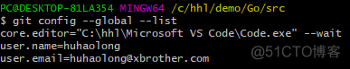

# Git-configure-password-free-login-GitHub
# Git配置免密登录Github

```
参考地址  https://blog.51cto.com/u_15077537/4513583
```


## 一、创建本地SSH公秘钥对

首先检查是否设置了Git的用户名和邮箱，输入：git config --global --list



如果没有设置，输入下面的指令进行设置：

```
git config --global user.name "用户名"
git config --global user.email "邮箱"
```

输入cd ~/.ssh查看是否已经创建了SSH公秘钥，如果没有创建则输入以下指令进行创建（连按三下回车）：

```
ssh-keygen -t rsa -C "邮箱"
```

创建成功后会在~目录创建一个.ssh文件夹，id_rsa存放秘钥，id_rsa.pub存放公钥

显示并复制SSH公钥：

```
cat ~/.ssh/id_rsa.pub
```


## 二、在Github添加SSH公钥
在Settings找到SSH and GPG keys，Title随便取，粘贴公钥，点击添加


## 三、创建一个Token
进入Settings/Developer settings，选择Personal access tokens，新建一个token（选项全选即可）


## 四、测试免密上传

使用一个本地仓库测试免密上传，在执行git push origin main之后，会弹出弹窗让输入账号和密码，账号输入github的用户名，密码输入上面的Token。

注意，如果输入错误了，需要输入以下指令清除信息，才能重新输入：

```
git config --system --unset credential.helper
```

以后再push就可以不用输入密码了

=======================================================

## 五、注意事项：

### 使用git和github的时候要使用网络代理并且开启全局模式

```
克隆仓库
git clone 仓库地址

更新代码到暂存区
git add .

添加代码到本地
git commit -m "提交备注信息"

提交代码至远程分支
git push origin 分支名称
如: git push origin main
```

